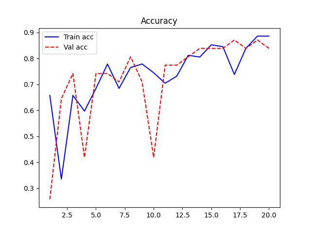
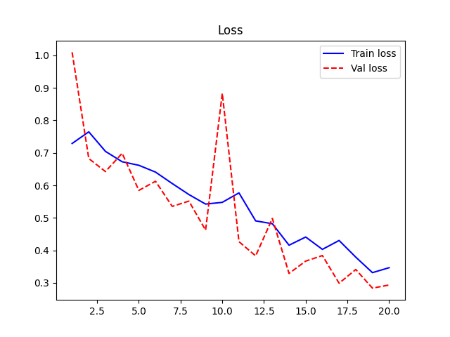
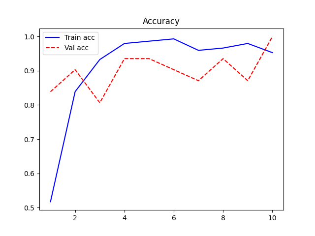
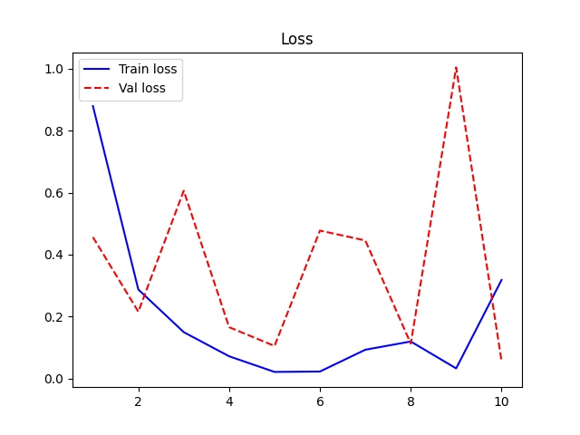
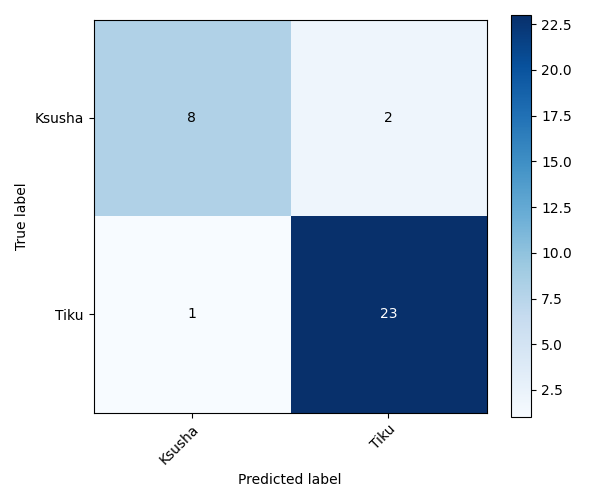

# Raportti

## Datasetin kuvaus

Tässä projektissa luokat ovat kaksi omaa kissaani: `Tiku` ja `Ksusha`.
Kuvat on kerätty omista kotikuvista eri kulmista, valaistusolosuhteissa ja asennoissa käyttäen puhelinta ja kameraa.
Kuvien esikäsittelyssä kaikki kuvat muutettiin kokoon 224 x 224, RGB-muotoon ja normalisoitiin välille 0-1.

Raw dataset sisältää yhteensä 214 kuvaa:

- `Ksusha`: 59 kuvaa
- `Tiku`: 155 kuvaa

Tämä täyttää tehtävänannon vähintään 50 kuvaa per luokka -vaatimuksen. Datan jako tehtiin 70/15/15-suhteella:

- Train: 149 kuvaa (108 Tiku, 41 Ksusha)
- Validation: 31 kuvaa (23 Tiku, 8 Ksusha)
- Test: 34 kuvaa (24 Tiku, 10 Ksusha)

Jaettu hakemistorakenne on:

```text
dataset/split/train/<luokka>/*
dataset/split/val/<luokka>/*
dataset/split/test/<luokka>/*
```

## Mallien suorituskyky

Projektissa toteutettiin tehtävänannon mukaiset kolme mallia:

- Malli 1: oma CNN-malli
- Malli 2: esikoulutettu VGG16 piirteenirrottajana
- Malli 3: hienosäädetty VGG16

Lisäksi omaa CNN-mallia testattiin augmentaatiolla, koska alkuperäinen CNN kärsi selvästi luokkien epätasapainosta.

### Tulosyhteenveto

| Malli | Menetelmä | Test accuracy | Huomio |
| --- | --- | ---: | --- |
| Malli 1 | Oma CNN, notebook-ajossa | 0.7353 | Oppi peruskuvion, mutta tulos jäi transfer learning -mallia heikommaksi. |
| Malli 1b | Oma CNN + augmentaatio, erillinen ajettu arviointi | 0.88 | Paransi yleistymistä ja vähemmistöluokan tunnistusta. |
| Malli 2 | VGG16 feature extraction, notebook-ajossa | 0.8824 | Paras notebook-ajon tulos; VGG16:n piirteet sopivat hyvin pieneen datasettiin. |
| Malli 3 | Hienosäädetty VGG16, notebook-ajossa | 0.7059 | Tässä uudelleenajossa ei parantanut tulosta, mikä viittaa ylisovittamisen tai epävakaan hienosäädön riskiin. |

### Tulosten vertailu

Baseline-CNN oppi peruskuvion, mutta pieni ja epätasapainoinen datasetti teki siitä epävarman. Augmentaatio auttoi, koska harjoitusdataan syntyi lisää vaihtelua valaistukseen, asentoon ja rajaukseen liittyen.

VGG16 feature extraction oli erityisen vahva tässä tehtävässä. Koska datasetti on pieni, esikoulutetun verkon yleiset kuvanpiirteet toimivat hyvin, ja vain oman luokittelijan kouluttaminen vähensi ylisovittamisen riskiä.

Hienosäädetty VGG16 oli tässä uudelleenajossa heikompi kuin feature extraction. Se näyttää, että pienellä datasetillä hienosäätö voi olla herkkä satunnaisuudelle, oppimisnopeudelle ja sille, kuinka monta kerrosta vapautetaan.

### Oppimiskäyrät

Seuraavat kuvat on tallennettu `report/`-kansioon ja ne havainnollistavat mallien oppimista:









Feature extraction -mallin tulokset näkyvät myös notebookissa `notebooks/03_feature_extraction_vgg16.ipynb` ja sen HTML-versiossa.

## Luotettavuusarvio testidatalle

Testidatan arviointi paljasti mallien käytännön erot.

### Baseline CNN

- Accuracy: 0.7353 notebook-ajossa
- Aiemmassa erillisessä arvioinnissa accuracy oli 0.71, ja malli painottui vahvasti Tiku-luokkaan.

Baseline-malli käytännössä painottui enemmistöluokkaan, joten sen accuracy näyttää paremmalta kuin todellinen luokkakohtainen suorituskyky.

### Augmented CNN

- Accuracy: 0.88
- Ksusha: precision 0.88, recall 0.70
- Tiku: precision 0.88, recall 0.96

Augmentaatio paransi erityisesti Ksusha-luokan tunnistusta ja vähensi mallin riippuvuutta yksittäisistä kuvaolosuhteista.

### VGG16 Feature Extraction

- Accuracy: 0.8824 notebook-ajossa
- Mallissa VGG16:n konvoluutiokerrokset pidettiin jäädytettyinä.
- Vain oma luokittelija koulutettiin omalle datasetille.

Tämä malli sopii hyvin tilanteeseen, jossa kuvia on rajallinen määrä mutta tunnistettava kohde on melko selkeä.

### Fine-tuned VGG16

- Accuracy: 0.7059 notebook-ajossa
- Erillisessä aiemmassa arvioinnissa tallennetulla mallilla saavutettiin parempi tulos, mutta tuore notebook-uudelleenajo jäi selvästi alemmaksi.

Fine-tuning ei tässä uudelleenajossa ollut paras ratkaisu. Pienessä datasetissä se voi helposti ylisovittua tai jäädä epävakaaksi, jos koulutusasetukset eivät osu hyvin kohdalleen.

### Confusion matrix

Alla on VGG16-hienosäädön confusion matrix testidatalle.



Testidatan väärin luokitellut kuvat olivat useimmiten `Ksusha`-luokkaa, joissa valaistus tai poseeraus poikkesi harjoitusdatasta. Tämä vahvistaa, että datan monipuolinen keruu ja augmentaatio auttavat parantamaan mallin yleistymistä.

Lisäksi tallensin `report/baseline_eval_confusion_matrix.png` ja `report/aug_run_eval_confusion_matrix.png` mallien vertailua varten.

## Haasteet ja ratkaisut

- Datan määrä oli rajallinen, erityisesti `Ksusha`-luokassa. Ratkaisuna käytin augmentaatiota ja luokkakohtaisia painoja.
- Datan epätasapaino vaikutti baseline-CNN:n oppimiseen, joten vertasin sitä myös esikoulutettuun VGG16-malliin.
- Mallin ylisovittamisen estämiseksi käytin validation-settiä ja `EarlyStopping`-periaatetta.
- Suuret `.h5`-mallitiedostot ja dataset-kuvat jätettiin GitHub-repon ulkopuolelle, koska ne ylittävät normaalin GitHub-repon kokorajoja.

## Pohdinta

Oma CNN on hyvä oppimisen kannalta, koska sen rakenne on helppo ymmärtää ja se näyttää konkreettisesti, miten konvoluutiokerrokset, pooling ja dense-luokittelija toimivat. Pienellä datasetillä se ei kuitenkaan ollut yhtä luotettava kuin transfer learning -mallit.

VGG16 feature extraction osoittautui tähän datasettiin erittäin sopivaksi. Malli hyödyntää ImageNetillä opittuja yleisiä piirteitä, kuten reunoja, tekstuureja ja muotoja, eikä yritä oppia koko kuvantunnistusta alusta asti pienestä datasta.

Hienosäädetty VGG16 vaatii pienessä datasetissä varovaisuutta. Jos vapautetaan liian monta kerrosta tai koulutetaan liian pitkään, malli voi alkaa ylisovittua tai antaa eri ajokerroilla vaihtelevia tuloksia.

## Johtopäätös

Tehtävänannon näkökulmasta projekti täyttää edistyneen osan vaatimukset: data pipeline toimii, kolme mallityyppiä on toteutettu, tuloksia on visualisoitu ja malleja on verrattu testidatalla.

Paras notebook-ajon testitarkkuus saatiin VGG16 feature extraction -mallilla (`0.8824`). Augmentoidun CNN-mallin erillinen arviointi oli lähes samalla tasolla (`0.88`). Käytännön suosituksena valitsisin tähän pieneen datasettiin VGG16 feature extraction -mallin, koska se hyödyntää esikoulutettuja piirteitä ja on todennäköisesti vähemmän altis ylisovittamiselle kuin hienosäädetty malli.
